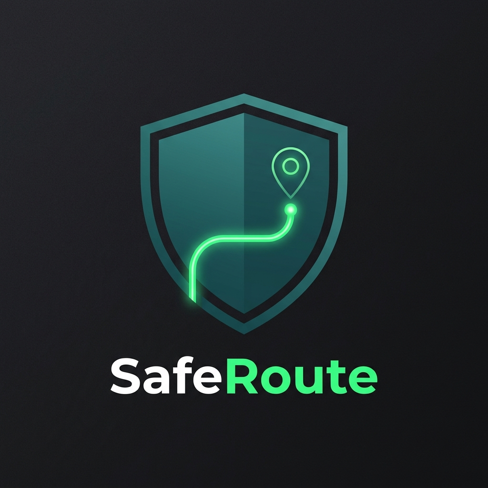
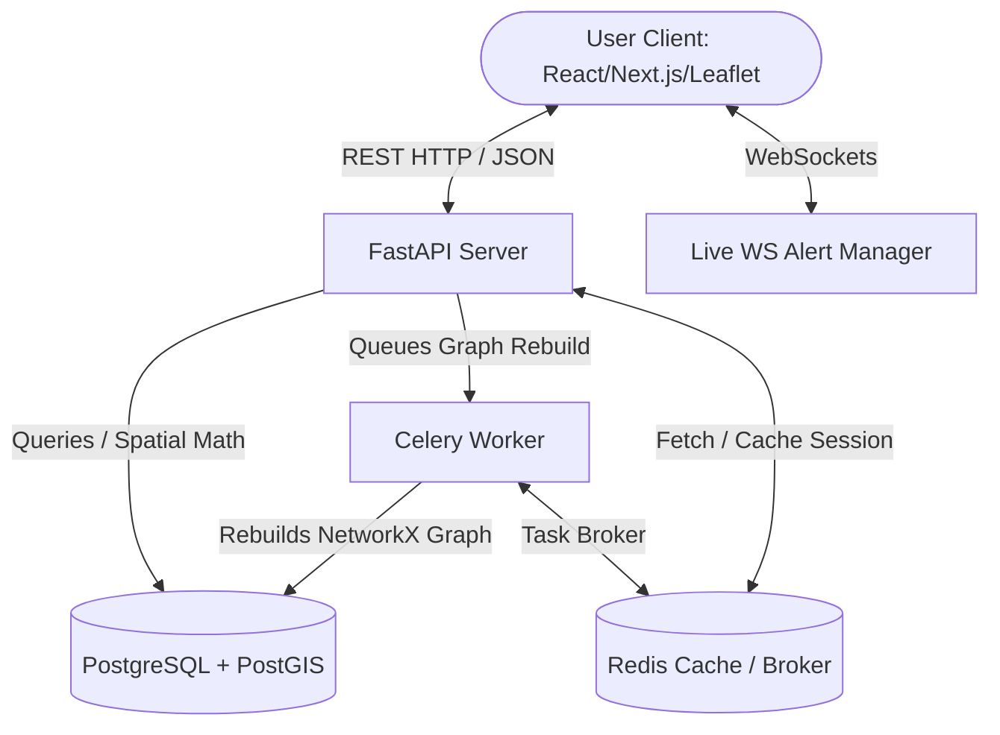

<div align="center">
  

  # SafeRoute Bengaluru 🚦🛡️

  <p align="center">
    <strong>An AI-powered, safety-first routing engine and real-time community safety network optimized for women's navigation in Bengaluru.</strong>
  </p>

  <!-- Core badging system -->
  <table>
    <tr>
      <td align="center"><strong>Frontend</strong></td>
      <td align="center"><strong>Backend API</strong></td>
      <td align="center"><strong>Database & GIS</strong></td>
      <td align="center"><strong>APIs & Services</strong></td>
    </tr>
    <tr>
      <td>
        
        <br />
        
        <br />
        
        <br />
        
      </td>
      <td>
        
        <br />
        
        <br />
        
        <br />
        
      </td>
      <td>
        
        <br />
        
        <br />
        
        <br />
        
      </td>
      <td>
        
        <br />
        
        <br />
        
        <br />
        
      </td>
    </tr>
  </table>

</div>

---

## 📖 Table of Contents
1. [Overview](#-overview)
2. [Key Features](#-key-features)
3. [Technology Stack & Third-Party APIs](#-technology-stack--third-party-apis)
4. [System Architecture](#-system-architecture)
5. [Project Directory Structure](#-project-directory-structure)
6. [Getting Started](#-getting-started)
    - [Prerequisites](#prerequisites)
    - [Database & Services Setup](#1-database--services-setup)
    - [Backend API Setup](#2-backend-api-setup)
    - [Frontend Web App Setup](#3-frontend-web-app-setup)
7. [Database Seeding & OSM Imports](#-database-seeding--osm-imports)
8. [Safety-Weighted Scoring Engine & Routing Math](#-safety-weighted-scoring-engine--routing-math)
9. [API Reference & WebSocket Protocol](#-api-reference--websocket-protocol)
10. [Contributors](#-contributors)

---

## 🔍 Overview

**SafeRoute Bengaluru** is an intelligent, safety-centric routing platform designed to safeguard commuters—particularly women—in urban environments. Traditional mapping apps calculate routes based strictly on time and distance. SafeRoute, however, computes the **safest walking, biking, or driving paths** by analyzing street lighting levels, CCTV coverage, crowd densities, historical crime data, and emergency facility locations.

---

## ✨ Key Features

*   **🛡️ Multi-Weighted Safety Routing**: Compute Safest, Balanced, and Fastest paths dynamically.
*   **📍 Live Turn-by-Turn GPS Navigation**: An interactive navigation HUD resembling premium interfaces, offering real-time distance counters, progress tracking, and direction changes (e.g., *"Turn left onto Residency Road"*).
*   **🔥 Live Safety Heatmap**: Highlights safe (green) and unsafe (red) zones based on real-time crowdsourced reports and city-wide data.
*   **🚨 Automatic SOS Alerts & Contacts**: Features a 3-second abort-countdown trigger to send simulated SMS alerts with live coordinates to trusted emergency contacts.
*   **📢 Community Safety Feed**: Crowdsource localized alerts (broken streetlights, construction hazards, suspicious groups) with community verification checks.
*   **📡 Real-Time Danger Alerts (WebSocket)**: Sends instantaneous push alerts to the mobile or web app if a user enters a segment with a safety score below `50`.

---

## 🛠️ Technology Stack & Third-Party APIs

### Core Frameworks
*   **Next.js 16 (React 19 & Tailwind CSS v4)**: Powers the fast, highly interactive client interface and fluid map visualizations.
*   **FastAPI**: A high-performance, asynchronous Python web framework for serving safety routes and managing WebSockets.

### Geospatial & Spatial Math Libraries
*   **Leaflet.js**: Enables client-side interactive map renders, polyline styling, and custom safety overlay layers.
*   **NetworkX**: Used on the backend to construct and query the directed routing graph.
*   **OSMnx**: Scrapes and models OpenStreetMap road networks.
*   **SciPy (cKDTree)**: Performs extremely fast 2D spatial queries to snap raw GPS coordinates to the nearest graph node.
*   **Shapely**: Handles coordinate calculations and geometry manipulation.

### Databases & Brokers
*   **PostgreSQL + PostGIS**: Stores spatial geometry columns, node coordinates, and safety asset records.
*   **Redis**: Used for routing calculations caching and as the message broker for background tasks.
*   **Celery**: Executes async tasks like rebuilding the routing graph or recalculating regional safety heatmaps.

### Third-Party APIs
*   **Twilio SMS API**: Handles real-time emergency dispatch alerts to trusted contacts.
*   **OpenStreetMap (OSM) / Overpass API**: Feeds physical street network layouts and infrastructure node locations.
*   **HTML5 Geolocation API**: Dispatches live tracking coords from the user's browser device.

---

## 🏗️ System Architecture



---

## 📂 Project Directory Structure

```
SafeRoute/
├── backend/                  # FastAPI Web Backend
│   ├── app/                  # Application code
│   │   ├── api/              # API router and endpoints (Auth, Route, SOS)
│   │   ├── core/             # Core logic (Safety scoring, Dijkstra routing, WS manager)
│   │   ├── models/           # SQLAlchemy DB models (CCTV, Crime, Nodes, Streets)
│   │   ├── schemas/          # Pydantic schemas for request/response validation
│   │   └── workers/          # Celery tasks (scoring refreshes, graph rebuilds)
│   ├── data/                 # OSM imports and synthetic seeding scripts
│   │   └── scripts/          # Database loader scripts
│   ├── migrations/           # Alembic database migrations
│   ├── tests/                # Pytest unit & integration test suites
│   ├── pyproject.toml        # Poetry package configuration
│   └── Dockerfile            # Container build spec
├── frontend/                 # Next.js 16 Client App (React 19, Tailwind v4, Leaflet)
│   ├── src/
│   │   ├── app/              # App router (Main map, Safety Feed, Settings)
│   │   ├── components/       # Custom React widgets (Leaflet Map, HUD, SOS slider)
│   │   └── utils/            # Core utilities (API client, navigation math)
│   ├── public/               # Static icons & UI graphics
│   └── package.json          # Node.js configurations
├── infra/                    # Docker Compose Infrastructure
│   └── docker-compose.yml    # PostgreSQL (PostGIS) and Redis services container config
├── assets/                   # README images & branding assets
├── SafeRoute_Bengaluru_PRD.md # Product Requirements Document
└── README.md                 # Project README
```

---

## 🚀 Getting Started

### Prerequisites

Ensure you have the following installed on your developer machine:
*   **Node.js** (v18.0+)
*   **Python** (v3.11+)
*   **Docker Desktop** (for PostgreSQL, PostGIS, and Redis)

---

### 1. Database & Services Setup

To run the platform, you need a running PostGIS database and Redis server. We package these inside a Docker Compose setup.

1.  Navigate to the infrastructure directory:
    ```bash
    cd infra
    ```
2.  Launch the containers in the background:
    ```bash
    docker-compose up -d
    ```
    *This starts PostgreSQL with PostGIS on port `5432` and Redis on port `6379`.*

---

### 2. Backend API Setup

1.  Navigate to the backend directory:
    ```bash
    cd ../backend
    ```
2.  Copy the environment template:
    ```bash
    copy .env.example .env    # Windows CMD/PowerShell
    # cp .env.example .env    # macOS/Linux
    ```
3.  Configure your credentials in `.env`.
4.  Install dependencies using Poetry:
    ```bash
    pip install poetry
    poetry install
    ```
5.  Run database migrations:
    ```bash
    poetry run alembic upgrade head
    ```
6.  Start the FastAPI application:
    ```bash
    poetry run uvicorn app.main:app --reload --port 8000
    ```
    *The backend will run on `http://localhost:8000`.*

---

### 3. Frontend Web App Setup

1.  Open a new terminal and navigate to the frontend directory:
    ```bash
    cd frontend
    ```
2.  Install packages:
    ```bash
    npm install
    ```
3.  Launch the dev server:
    ```bash
    npm run dev
    ```
    *Open `http://localhost:3000` in your browser to run the application.*

---

## 💾 Database Seeding & OSM Imports

The backend includes tools to scrape OpenStreetMap data for Bengaluru and generate synthetic safety assets.

1.  **Seed Base OSM Road Network**:
    Imports Bengaluru geographic nodes and segments:
    ```bash
    poetry run python data/scripts/import_osm.py
    ```
2.  **Generate Safety Assets (CCTV, Lights, Facilities)**:
    Seeds mockup locations for streetlights, police stations, hospital coordinates, and camera networks:
    ```bash
    poetry run python data/scripts/seed_synthetic_network.py
    ```
3.  **Ingest Historical Crime Incidents**:
    ```bash
    poetry run python data/scripts/import_ncrb.py
    ```

---

## 🧮 Safety-Weighted Scoring Engine & Routing Math

### Safety Score Calculation
The safety score ($S$) of each road segment is computed dynamically as a weighted sum of positive safety attributes minus penalties for negative attributes, bound between $[0, 100]$:

$$S = \text{clamp}\left( w_1 \cdot \text{Lighting} + w_2 \cdot \text{CCTV} + w_3 \cdot \text{Crowd} + w_4 \cdot \text{Emergency} - \text{Crime Penalty}, \, 0, \, 100 \right)$$

#### Factor Weights:
*   **Lighting ($w_1 = 0.35$)**: Streetlight density and average luminosity.
*   **CCTV ($w_2 = 0.25$)**: Active camera count and intersection coverage.
*   **Crowd ($w_3 = 0.20$)**: Pedestrian densities, based on live signals and venue check-ins.
*   **Emergency ($w_4 = 0.20$)**: Proximity to police stations, health clinics, and help hubs.
*   **Crime Penalty**: Computed based on historical incidents near the segment.

---

### Safety-Cost Routing Function
To calculate the path, we override the standard Dijkstra path-finding weight (which normally just checks distance or travel time) by incorporating the segment's safety score into the cost calculation.

The adjusted cost ($C$) for walking along a road segment of length $L$ is calculated as:

$$C = L \cdot \left(1 + \beta \cdot \left(1 - \frac{S}{100}\right)\right)$$

Where **$\beta$** represents the **Safety Influence Coefficient**:
*   **Safest Route ($\beta = 10.0$)**: High penalty for lower safety scores. The router will add up to a 10x virtual length penalty to detour around unsafe roads.
*   **Balanced Route ($\beta = 2.0$)**: Moderately weighs safety and distance.
*   **Fastest Route ($\beta = 0.0$)**: Ignores safety entirely ($C = L$). Returns the shortest path.

---

## 📡 API Reference & WebSocket Protocol

### 🔑 Authentication Flow

All protected endpoints require a Bearer token.
1.  **Request OTP**:
    `POST /api/v1/auth/request-otp`
    ```json
    { "phone_number": "+919876543210" }
    ```
2.  **Verify OTP**:
    `POST /api/v1/auth/verify-otp`
    ```json
    { "phone_number": "+919876543210", "otp_code": "123456" }
    ```
    *Returns: `{ "access_token": "JWT_TOKEN", "token_type": "bearer" }`*

---

### 🗺️ Route Options Endpoint
`POST /api/v1/route/options`

**Request Body**:
```json
{
  "source": { "lat": 12.9352, "lng": 77.6245 },
  "destination": { "lat": 12.9784, "lng": 77.6408 }
}
```

**Response**:
Returns a GeoJSON list containing `safest`, `balanced`, and `fastest` routes with calculated safety metrics for each road segment.

---

### 📡 Real-Time Danger WebSocket
*   **Endpoint**: `ws://localhost:8000/api/v1/ws/live`
*   **Action**: Establish connection, then send user coordinates continuously:
    ```json
    { "lat": 12.9362, "lng": 77.6255 }
    ```
*   **Server Event**: If the user enters a coordinate snap segment with safety scoring under `50`, the server broadcasts:
    ```json
    {
      "event_type": "DANGER_ALERT",
      "message": "Warning: Approaching low-light zone with high crime history.",
      "safety_score": 42
    }
    ```

---

## 👥 Contributors

*   **Niranjan K** (Lead Backend Engineer & Data Scientist)
*   **Tushar Jain** (Lead Frontend & Interaction Designer)
